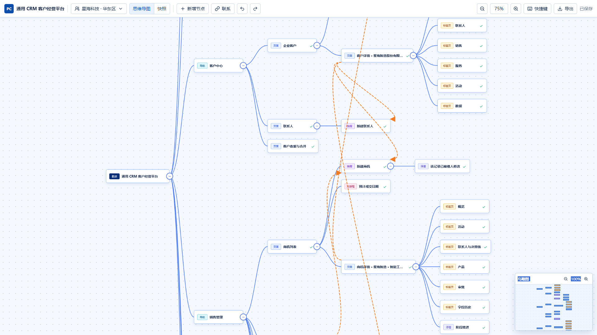
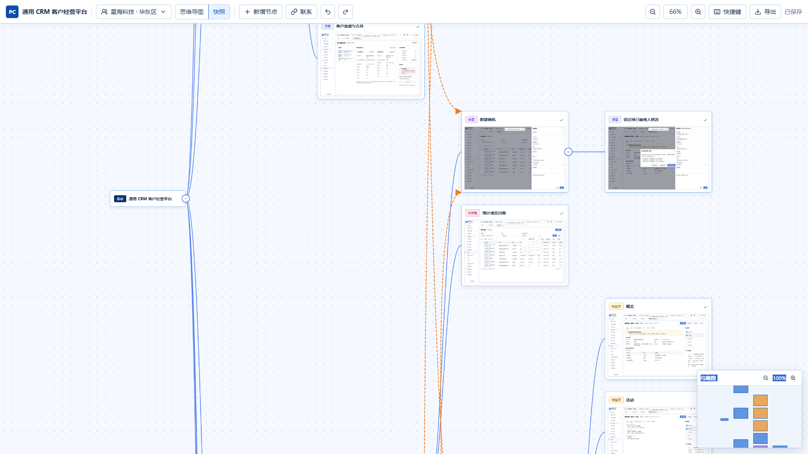
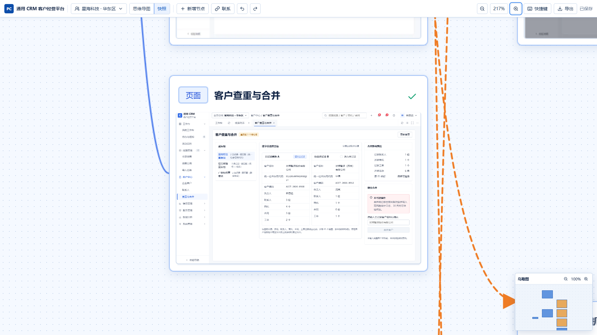
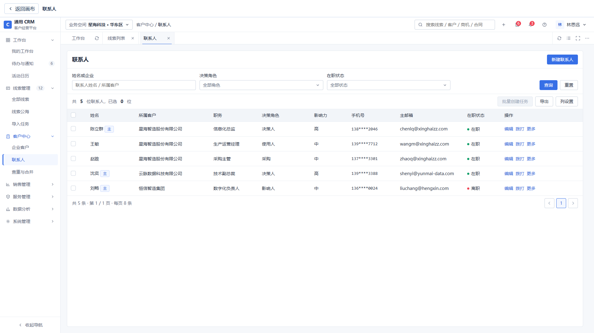
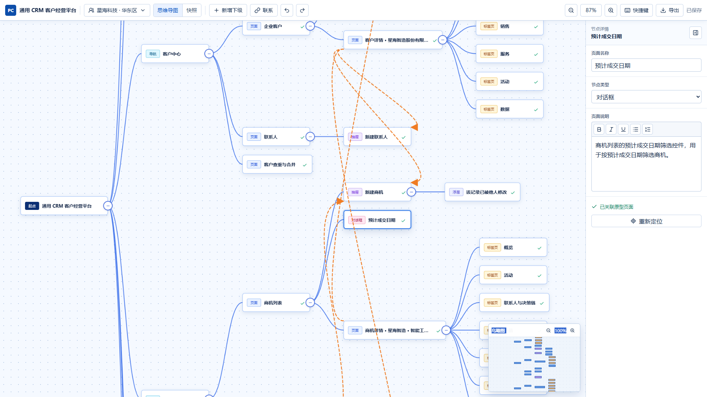
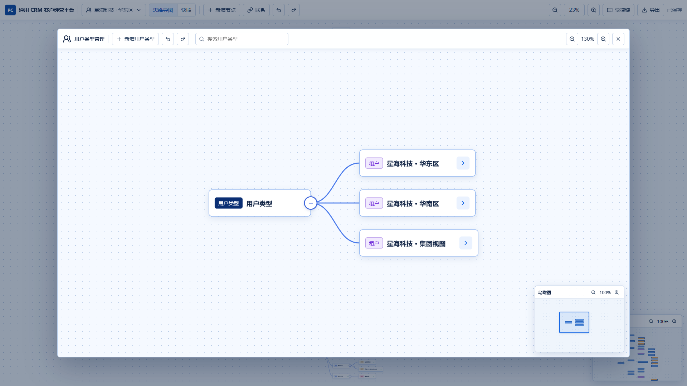
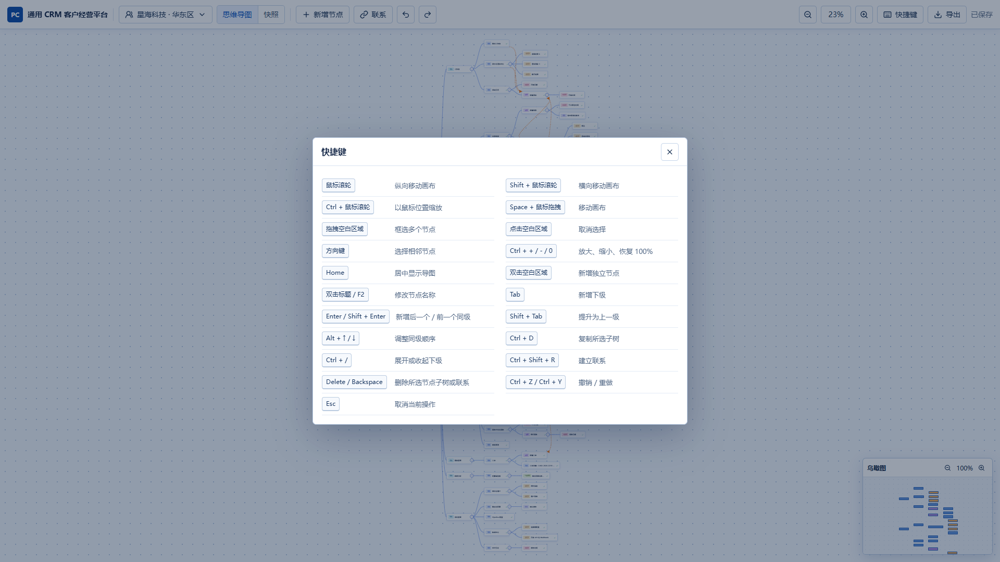
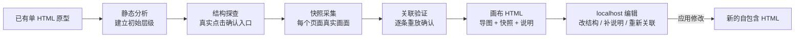

# 原型 HTML 画布（Prototype Canvas）

[](https://github.com/lin96008-maxlin/prototype-canvas/actions/workflows/ci.yml)
[](./LICENSE)
[](./prototype-canvas/SKILL.md)
[](#最终交付是什么)


让原型自己长出一张地图，而不是让产品经理在几十个页面、标签页和弹窗之间反复点开寻找。

单 HTML 原型做起来很快，做大了却很难讲清楚：这个文件里到底有多少页面、哪些是同一件事的不同状态、每个页面又是由哪个按钮点进去的。评审时说不清范围，交接时讲不明白入口，验收时更是没人敢确认「是不是都覆盖到了」。

Prototype Canvas 把已有原型通读一遍，生成一张可导航的画布：**思维导图**负责讲清层级与关系，**快照图**直接展示每个页面真实长什么样，双击任意节点就能进入原型对应页面。它还能在 localhost 编辑工作台里调整结构、补充页面说明、按业务空间分别管理关联，最后导出一份新的自包含 HTML。

**核心定位：一份 HTML，既是可交互原型，也是一张能讲清全局的页面地图。**

## 核心价值

- **一眼看清全局**：起点、导航、页面、标签页、抽屉、弹窗、步骤、页面状态各有形状和颜色；层级线表达「谁属于谁」，橙色虚线表达「谁和谁有关联」。
- **缩着看结构，放大看真相**：缩小到一定程度每个节点显示该页面的预览图；放大到节点足够大时，画布自动在该节点位置加载真实原型，直接就能操作，不用另外开窗口。
- **双击直达那一页**：双击任意节点，立刻进入它关联的页面——不管那一页是普通页面、标签页、抽屉、弹窗，还是折叠起来的下拉与浮层。
- **任意交互都能挂上**：每个节点都能关联任意页面与交互，不限于页面级跳转；一句话说不清的关系，用连线表达。
- **不同业务空间各画一张**：多租户、多区域、多角色的原型可以按用户类型分别生成画布，同一份原型各看各的，互不干扰。
- **关联是验证过的，不是猜的**：所有关联都会从原型初始状态真实跑一遍，跑通才写入；在原型里点一遍就能重新定位，不用手写选择器。
- **把说明写进画布**：页面用途、使用对象、业务结果直接挂在节点上，评审和交接时不用再另开一份文档对照。
- **导出即交付**：可导出完整思维导图 SVG 与内嵌预览的页面快照 SVG，也可以把编辑结果应用为一份新的自包含 HTML。
- **离线、可传递、无服务依赖**：导出的 HTML 内嵌原型与画布运行时，断网也能打开、双击和导出。

## 功能展示

> 以下截图使用演示数据（通用 CRM 客户经营平台），仅用于展示 Skill 的交互与呈现能力。

### 思维导图模式：看清页面与交互的层级

从系统起点出发，一级导航、页面、下钻交互逐层展开。节点类型一眼可辨，橙色虚线是需要单独说明的跨页面关联，而不是层级归属。



### 快照模式：每个页面都有真实预览

同一棵树切换成快照视图，每个节点换成该页面真实运行画面。缩略图按内容自动去重，同一画面只存一份；适合评审开场先整体过一遍，也适合交接时快速确认范围。



### 放大即加载：把真实原型嵌在节点里

放大到节点足够大时，画布会自动在视口中心附近最合适的节点位置加载真实原型 HTML，无需先选中就能直接在画布里操作；平移和小幅缩放复用同一个原型实例，不会反复重新加载。加载失败或尚未就绪时继续显示缩略图，不会留白。



### 双击进入：直接落到那一页

双击节点立刻进入它关联的页面，打开的就是原型本身，可以继续点、继续走流程；点左上角「返回画布」回到地图。



### 节点编辑：在画布里改结构、写说明

选中节点即可修改页面名称、节点类型和页面说明。说明支持富文本，保存后随画布一起交付；节点也能新增、拖动换层级、复制子树或删除。

每个节点都可以关联任意页面与交互——普通页面、业务标签页、抽屉、弹窗、对话框、底部面板、气泡浮层、表单步骤、页面状态都能作为关联目标，节点也可以完全不关联。关联保存多重定位信息（语义选择器、可访问名称、有限结构路径），原型元素顺序变化后仍能重新找到；重新定位时只要在原型里点一遍，系统会记录路径并验证能不能真正走到。同一个节点在不同用户类型下可以有不同的关联，多业务空间互不影响。



### 用户类型：不同业务空间各有一张画布

按用户类型（租户、部门、岗位、角色等）组织画布。每个末级用户类型对应一张独立画布，页面结构与关联互不干扰，可以分别编辑和导出。



### 快捷键：常用操作都有键位

新建下级、调整顺序、复制子树、建立联系、撤销重做都支持快捷键；滚轮平移、Ctrl + 滚轮缩放、空格拖拽画布，符合常见的导图操作习惯。



## 主要能力

| 领域 | 能力 |
| --- | --- |
| 结构识别 | 通读原型源码与运行行为，识别页面、导航层级、标签页、抽屉、弹窗、对话框、底部面板、浮层、步骤和页面状态 |
| 结构探查 | 在浏览器里逐个点击真实入口，按实际结果确认「哪个入口能走到哪个页面」，不靠猜；任何 HTML 原型都适用 |
| 双模式视图 | 思维导图与快照两种模式；各自记住位置、缩放和视口，切换时按视口中心附近节点做视觉锚定 |
| 缩略预览 | 缩小时节点显示该页面真实运行画面；画面按内容哈希去重，只保留一份资源 |
| 实时原型 | 放大到节点足够大时自动加载真实原型，无需选中；同一时刻只保留一个原型实例，平移与小幅缩放复用不重载 |
| 快速预览 | 双击节点直接进入关联页面；复用已就绪的实例，不重复加载；失败或超时保留缩略图并给出提示 |
| 节点关联 | 任意节点可关联页面、标签页、抽屉、弹窗、对话框、底部面板、气泡浮层、浮层、表单步骤、页面状态；允许完全不关联 |
| 关联定位 | 语义选择器 + 可访问名称 + 有限结构路径多重定位；元素顺序变化后仍可重新查找，序号匹配不上不会误点其他控件 |
| 关联验证 | 每条关联从整页初始状态重放确认；点击后界面没有变化的操作自动剔除，不会写进关联路径 |
| 重新定位 | 在原型里实际操作一遍即可记录路径；已有关联会先自动打开，新路径与原关联完全相同时给出提示而不是静默保存 |
| 结构编辑 | 新增节点、新增下级/同级、复制子树、删除整棵子树；拖动换父级、同级排序、脱离为独立树、吸附进其他树、框选整组拖动 |
| 两类连线 | 层级线自动生成且不可单独编辑；联系线可创建、选中、改端点、调曲线，用于表达跨页面关系 |
| 折叠与选择 | 折叠展开下级（收起时显示直接下级数量）、框选多节点、单击选中并打开介绍面板 |
| 页面说明 | 富文本说明（粗体/斜体/下划线/列表），面向业务讲清使用对象、场景、用途与结果；技术细节不进入说明 |
| 用户类型 | 多级用户类型树（租户、部门、岗位、角色、权限等），末级类型对应一张独立画布，可分别编辑与导出 |
| 用户类型管理 | 大弹窗形式的思维导图：搜索、缩放、框选、拖拽、增删改、折叠、鸟瞰图定位，并进入末级画布 |
| 画布导航 | 滚轮平移、`Shift + 滚轮` 横向平移、`Ctrl + 滚轮` 以鼠标位置缩放、空格拖拽平移、`Home` 居中、方向键选择相邻节点；平移受内容边界约束 |
| 鸟瞰图 | 独立倍率与双向滚动条，拖视口框定位；滚轮只影响鸟瞰图自身，不带动主画布 |
| 快捷键 | 覆盖新增下级/同级、调整顺序、复制子树、建立联系、展开收起、删除、撤销重做与取消操作 |
| 本地编辑 | localhost 工作台：改名称、改类型、改说明、调结构、建联系、逐节点重新定位；编辑内容先写入会话，不写回源 HTML |
| 导出交付 | 导出完整思维导图 SVG 与内嵌预览的页面快照 SVG（含全部连线与图例）；也可以把编辑结果应用为新的自包含 HTML |
| 质量门禁 | 页面说明业务化校验、已关联节点必须有可用预览才允许发布、画布自包含审计、关联体检 |
| 单文件交付 | 内嵌原型、画布运行时与样式，不依赖 CDN、网络图片或业务后端；断网可用 |

## 工作方式



Skill 不重新设计业务界面，也不改动原型业务逻辑。它只读取原型、补充画布所需的定位信息，并把画布与原型一起封装成新的 HTML。

## 安装

### 环境要求

- 已安装并可使用 Codex；
- 已安装 Python 3，用于运行 Codex 内置 Skill 安装器；
- 已安装 Node.js 18 或更高版本；
- 本机有 Chrome 或 Edge，用于生成页面预览与结构探查。

### 方式一：使用 Codex 内置安装器

PowerShell：

```powershell
python "$HOME\.codex\skills\.system\skill-installer\scripts\install-skill-from-github.py" `
  --repo lin96008-maxlin/prototype-canvas `
  --path prototype-canvas
```

macOS / Linux：

```bash
python ~/.codex/skills/.system/skill-installer/scripts/install-skill-from-github.py \
  --repo lin96008-maxlin/prototype-canvas \
  --path prototype-canvas
```

安装器会把 Skill 安装到 `~/.codex/skills/prototype-canvas`。安装成功后从下一轮对话开始使用。

### 方式二：手动安装

PowerShell：

```powershell
git clone https://github.com/lin96008-maxlin/prototype-canvas.git
New-Item -ItemType Directory -Force "$HOME\.codex\skills" | Out-Null
Copy-Item -Recurse ".\prototype-canvas\prototype-canvas" "$HOME\.codex\skills\prototype-canvas"
```

macOS / Linux：

```bash
git clone https://github.com/lin96008-maxlin/prototype-canvas.git
mkdir -p ~/.codex/skills
cp -R ./prototype-canvas/prototype-canvas ~/.codex/skills/prototype-canvas
```

首次运行时 Skill 会在自己的目录里安装 Node 依赖。

## 使用方式

不需要记脚本命令。正常情况下在 Codex 对话里点名 `$prototype-canvas`，并给出目标 HTML 路径即可。

### 生成画布

```text
使用 $prototype-canvas，为 C:\path\to\prototype.html 生成原型画布。
```

Skill 会依次完成：通读原型 → 在浏览器里探查真实入口 → 采集每个页面的运行画面 → 逐条验证页面关联 → 生成画布，并在导出前做一次自包含检查。

有 PRD、需求说明或用户类型划分时一并提供，页面说明会写得更贴合业务。

### 进入本地编辑模式

```text
使用 $prototype-canvas，打开 C:\path\to\prototype.html 的画布编辑模式。
```

Codex 会启动 localhost 服务并返回实际地址。工作台支持：

- 修改节点名称、类型和页面说明；
- 新增节点、拖动换层级、调整同级顺序、复制子树、删除节点；
- 建立和编辑联系线；
- 切换用户类型，分别编辑每张画布；
- 重新定位某个节点的页面关联；
- 查看鸟瞰图、缩放平移、导出 SVG。

### 应用本轮修改

```text
使用 $prototype-canvas，应用本轮画布修改。
```

Skill 会读取当前活动会话，将修改应用为一份新的自包含 HTML，不覆盖原文件。

## 什么值得画进画布

画布的价值不是把节点堆满，而是把「说不清的关系」变成看得见的结构。

| 应该进画布 | 说明 |
| --- | --- |
| 页面与它的真实入口 | 从哪个导航、按钮或行操作进入，双击就能落到该页面 |
| 业务状态与步骤 | 同一页面的不同状态、向导的不同步骤，属于页面而不是独立树 |
| 抽屉、弹窗与浮层 | 按真实打开路径归属到触发它的页面 |
| 跨页面关联 | 需要单独说明的跳转、联动或数据来源，用联系线表达 |
| 页面说明 | 谁在什么场景用、解决什么问题、主要处理什么、产生什么结果 |

没有事实依据的业务规则会被标为待确认，不会凭行业常识补造。

## 日常怎么用

**评审开场，先讲清范围。** 打开画布，从系统起点往下走一遍：这次改了哪些页面、新增了哪些弹窗、哪几个页面是同一件事的不同状态。比翻原型文件快得多，也比口头描述清楚。

**边讲边点，随时跳转。** 讲到某个页面时直接双击节点进入原型，现场点流程、看状态；讲完点「返回画布」继续。不用在浏览器标签之间来回找。

**交接与验收，确认覆盖。** 用快照模式整体过一遍，每个页面长什么样一目了然；验收时对着画布逐条核对，避免漏掉藏在抽屉和弹窗里的分支。

**自己先自查。** 生成画布的过程本身就会指出问题：哪些入口点了没反应、哪些关联走不通、哪些页面还没有说明。发布前跑一次关联体检，比等到评审现场出状况划算。

**改完再接下一轮。** 结构变更直接在画布里调：拖动换层级、新增模块、建联系线，然后应用为一份新的 HTML。

## 适用场景

适合：

- 原型评审开场讲清范围与结构；
- 复杂后台、多页面流程、多业务空间原型的梳理与交接；
- 需要把页面说明和原型一起交付，而不想维护多份对照文档的团队；
- 需要一份可离线打开、可直接传递的画布文件。

不负责：

- 重新设计业务页面或替换现有 UI 设计体系；
- 根据零散需求从头生成完整业务原型；
- 在没有事实依据时补造业务规则。

## 目录结构

| 路径 | 用途 |
| --- | --- |
| `prototype-canvas/SKILL.md` | Skill 入口、任务路由与流程要求 |
| `prototype-canvas/references/` | 工作流、画布数据模型、原型通信协议与交互基线 |
| `prototype-canvas/assets/` | 画布运行时、样式、原型桥接脚本 |
| `prototype-canvas/scripts/` | 分析、探查、复核、验证、采集、生成与本地服务 |
| `prototype-canvas/tests/` | Skill 回归夹具 |
| `docs/images/` | README 功能截图，可用同名文件直接替换 |
| `docs/capture-screenshots.mjs` | 截图脚本（1920×1080） |
| `.github/` | 持续集成、贡献指南与安全说明 |
| `LICENSE` | 本项目自研部分的 MIT License |
| `THIRD_PARTY_NOTICES.md` | 第三方组件与许可证边界 |

## 技术说明

- 分析与生成脚本使用 Node.js 标准库与轻量 HTML 解析，不依赖业务后端；
- 页面预览、结构探查与关联验证使用 Playwright 驱动本机 Chrome 或 Edge；
- 画布运行时内嵌进导出的 HTML，双击节点时在沙箱 iframe 中回放原型；
- 关联记录保存语义选择器、可访问名称与有限结构路径等多重定位信息，元素顺序变化后可重新查找；
- 画布数据保存在原型文件旁的 `.prototype-canvas/` 目录，不会写入原型本身。

## 质量检查

安装依赖后可直接运行 Skill 回归：

```bash
cd prototype-canvas
npm install
node scripts/test-skill.mjs
```

回归覆盖画布数据模型校验、层级归属约束、页面说明质量门禁、快照采集、画布生成、自包含审计与本地编辑会话。GitHub Actions 会在每次推送和 Pull Request 时执行依赖安装、语法检查与完整回归。

## 安全与隐私

- 画布快照会保存页面运行画面，可能包含真实客户名称与业务数据，外发前请按接收对象检查数据边界。
- `.prototype-canvas/` 目录可能保存未应用的编辑会话与快照，已被 `.gitignore` 排除，但仍需按项目要求管理。
- localhost 编辑地址包含随机会话 Token，只应在本机使用，不要转发或映射到公网。
- 不要把真实客户信息、内部系统地址、账号或密钥提交到公共仓库。
- 安全问题请通过 [GitHub Private Vulnerability Reporting](https://github.com/lin96008-maxlin/prototype-canvas/security/advisories/new) 私下反馈，详细说明见 [SECURITY.md](./.github/SECURITY.md)。

## 参与贡献

欢迎产品经理、设计师和开发者提交使用场景、兼容性问题与交互改进。提交前请阅读 [贡献指南](./.github/CONTRIBUTING.md)，并确保没有包含真实业务数据或公司专属信息。

## 开源许可

本项目自研部分采用 [MIT License](LICENSE)。第三方组件的许可证与归属见 [THIRD_PARTY_NOTICES.md](THIRD_PARTY_NOTICES.md)。

## 最终交付是什么

最终产物是一份普通 `.html` 文件，可以直接用浏览器打开、通过聊天工具传递，或上传到任意静态文件托管平台。它包含：

- 原有业务原型及其交互；
- 可导航的思维导图与页面快照；
- 每个节点的页面说明；
- 按用户类型划分的多张画布；
- 画布运行时与必要样式。

localhost 编辑工作台只在本机编辑时临时启动，不会作为编辑能力写入最终交付文件。
